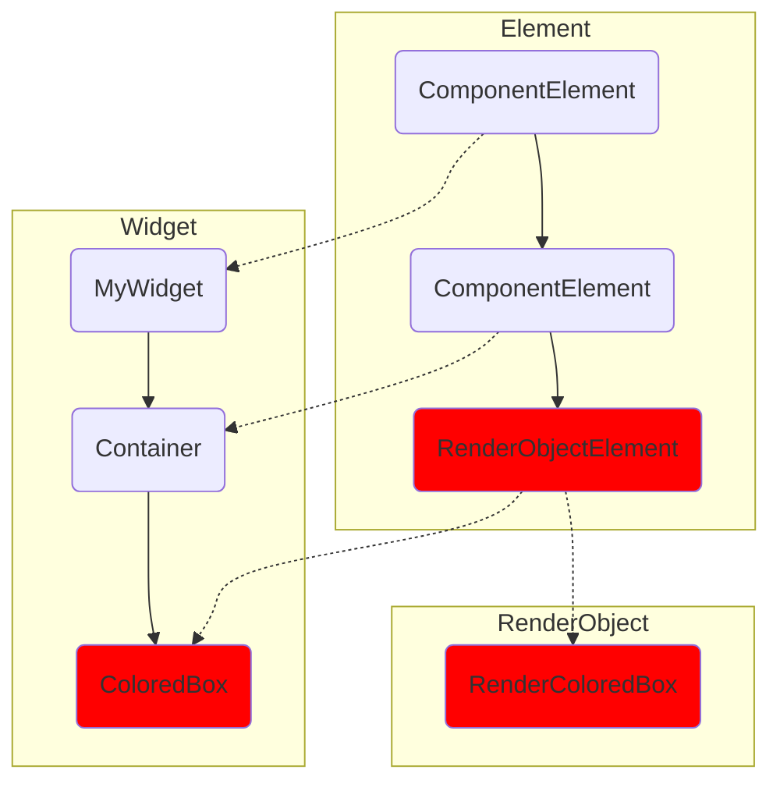

All the different phases that are responsible for rendering are

*   Build

*   Layout

*   Paint

And then all of this create a display list that then will be rasterized by GPU

Build phase is what we as Flutter developers are responsible for.  This is the rendering phase that we control the most. This is where our widgets get to be built and the subsequent elements for those widgets get inflated.

And from those elements, we also create the relevant RenderObjects and head to the Layout and Paint phase. And the Render Object or Flutter framework will take care of those phases and we don’t need to worry about layout and painting.

The Flutter trees: there are 3 trees:

*   Widget

*   Element

*   RenderObject

Let’s take an example: let say we have a widget named `MyWidget` which contains a `Container` with red color:

```dart
class MyWidget extends StatelessWidget {
	const MyWidget({super.key});
	
	@override
	Widget build(BuildContext context) {
		return Container(
			color: Colors.red,
		);
	}
}
```

Our `Widget Tree`, `Element Tree` and `RenderObjectTree` would look like this:



So, in the above `Widget Tree`, the Flutter framework creates a `ColoredBox` under the hood and the `ColoredBox` is the actual widget that the Element takes the color property from. The `ColoredBox` is actually a `SingleChildRenderObjectWidget` .

For each widget in Widget Tree, Flutter framework creates correspondent element which are `ComponentElement` - the element that composes other elements and `SingleChildRenderObjectElement` - the element that uses a `SingleChildRenderObjectWidget` as its configuration and creates a `RenderObject`, in this case, the `RenderObject` is `RenderColoredBox`.

As you can see, not every element could create its own RenderObject. RenderObjects in the RenderObjectTree are the actual   that would be laid out and painted on the screen.

Performance:

Run the app in the real device with using the —profile mode. You could run it on simulator or emulator but it would not indicate the right performance of the app.

To check the performance of the app, you can use the Performance section in Flutter DevTools.

You could use Enhance Tracing to track Widget Builds, see that if a Widget has suspect rebuild. You can also know the times it takes to complete a frame which is important. If it takes too long, it will cause jank in the application. Jank is when your application drops too many frames and feels stutter and it becomes noticeable and people will complain.
